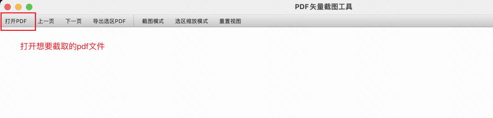
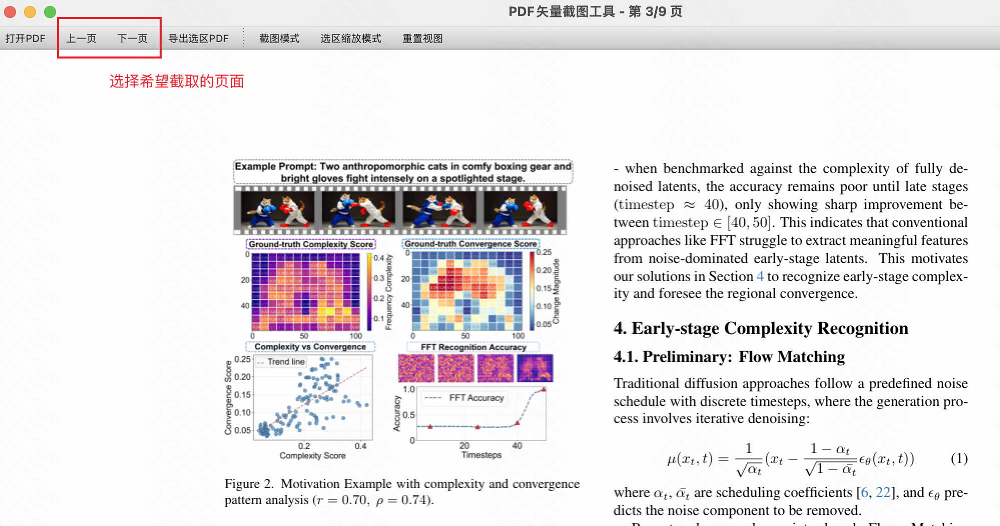
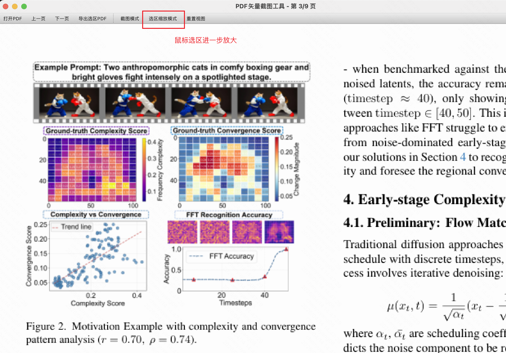
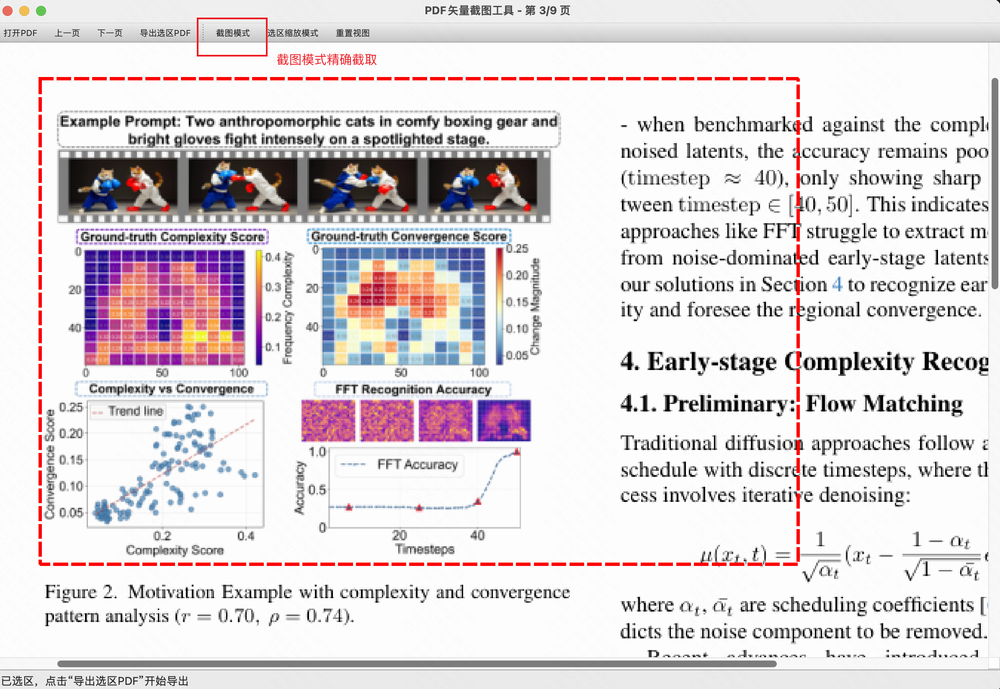
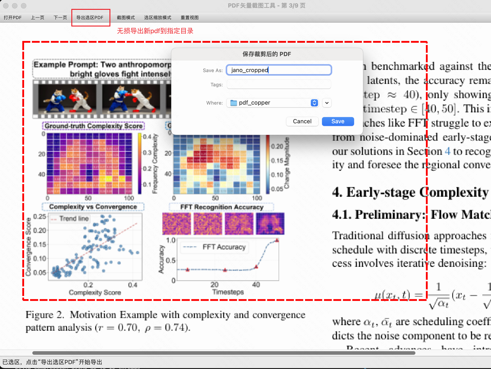

# PDF 矢量截图工具 / PDF Vector Crop Tool

一个基于 Python 的图形化 PDF 截图工具。  
A Python-based GUI tool for cropping and exporting PDF regions.

## 功能 / Features

- 打开 PDF 文件 / Open PDF files
- 鼠标拖拽框选页面区域 / Drag to select a region on a page
- 导出当前选区为新的 PDF / Export the current selection as a new PDF
- 采用矢量裁剪方式，尽量保留原始矢量效果 / Preserve vector quality via vector-based clipping

## 环境要求 / Requirements

- Python 3.10+
- macOS / Linux / Windows
- PySide6 runtime

说明：当前项目在 macOS 上已验证 `PySide6==6.7.3` 可正常启动。  
Note: On macOS, this project has been verified to run with `PySide6==6.7.3`.

## 安装 / Installation

```bash
python3 -m venv .venv
source .venv/bin/activate  # Windows: .venv\Scripts\activate
python -m pip install -U pip
python -m pip install -r requirements.txt
```

## 运行 / Run

```bash
python app.py
```

如果遇到 Qt 插件报错（例如 `Could not find the Qt platform plugin "cocoa"`），请先确保使用虚拟环境解释器运行：  
If you see a Qt plugin error (e.g. `Could not find the Qt platform plugin "cocoa"`), make sure you are using the virtual environment interpreter:

```bash
.venv/bin/python app.py
```

若仍失败，可检查插件目录：  
If it still fails, check the plugin directory:

```bash
.venv/bin/python -c "import PySide6, pathlib; p=pathlib.Path(PySide6.__file__).resolve().parent/'Qt/plugins/platforms'; print(p, p.exists())"
```

如果持续报 `cocoa` 插件错误，通常说明 `.venv` 中 PySide6 安装损坏，可重建环境：  
If the `cocoa` plugin error persists, PySide6 in `.venv` is likely broken; recreate the environment:

```bash
rm -rf .venv
/opt/homebrew/bin/python3.12 -m venv .venv
.venv/bin/python -m pip install -U pip setuptools wheel
.venv/bin/pip install --no-compile -r requirements.txt
.venv/bin/python app.py
```

## 使用步骤 / Usage

1. 点击“打开PDF”选择文件。 / Click "Open PDF" and choose a file.
2. 在页面上按住鼠标左键拖动，框选目标区域。 / Drag with the left mouse button to select a target region.
3. 点击“导出选区PDF”。 / Click "Export Selected Region PDF".
4. 选择保存路径，完成导出。 / Choose a save path to finish export.

## Example（示例流程）

### 1) 打开 PDF / Open PDF



### 2) 选择页面 / Choose Page



### 3) 选区缩放 / Zoom Selection



### 4) 截取 / Crop Region



### 5) 导出选区 PDF / Export Selected Region PDF



## 实现说明 / Implementation Notes

- 页面显示：通过 PyMuPDF 渲染预览图，显示到 PySide6 图形视图。  
	Rendering: PyMuPDF renders page previews shown in a PySide6 graphics view.
- 坐标换算：将画布选区坐标按缩放比映射回 PDF 页面坐标。  
	Coordinates: Selection coordinates are mapped back to PDF page coordinates by scale ratio.
- 矢量导出：使用 `show_pdf_page(..., clip=...)` 从源页直接裁剪写入新页，避免位图化导出。  
	Vector export: Uses `show_pdf_page(..., clip=...)` to clip directly from source pages and avoid rasterization.

## 已知限制 / Known Limitations
- 预览状态的pdf为略缩图 / The PDF in preview mode is a thumbnail.
- 当前版本每次导出仅针对当前页面的一个选区。  
	Current version exports one selection from the current page each time.
- 复杂 PDF（透明、混合模式、特殊字体）在不同阅读器中显示可能存在细微差异。  
	Complex PDFs (transparency, blend modes, special fonts) may render slightly differently across viewers.
